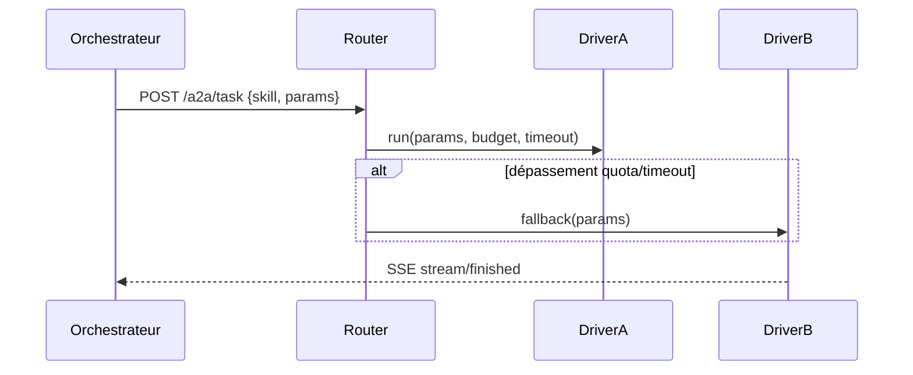

# 🎛️ Espace Projet — Poly‑Agents CLI

**Date de création :** 2025‑10‑11
**Périmètre :** Suivi, évaluation et conception d’une architecture poly‑agents centrée sur 4 agents CLI : **Jules (Google)**, **Gemini CLI**, **Codex CLI**, **Claude Code**.
**Contexte :** Passage d’une architecture « Claude‑centrée » (18 août 2025) à un **orchestrateur multi‑drivers** (A2A/ADK) conscient des **quotas/durées**, des **workflows**, et des **écosystèmes** (MCPs, extensions, outils, sub‑agents).

---

## 1) Objectifs

* 📦 **Espace unique** pour suivre l’évolution des 4 agents et leurs écosystèmes (extensions, MCPs, outils, sub‑agents).
* 📈 **Évaluer le rendement** : fiabilité, coût/latence, couverture de tâches, stabilité.
* 🔬 **Cartographier forces/faiblesses** malgré l’évolution rapide des agents.
* 🔄 **Analyser les workflows** end‑to‑end (A2A skills → drivers) et leurs échecs/handoffs.
* 🧱 **Concevoir la structure cible** (router, policies, budgets/quotas, sécurité, observabilité).

---

## 2) Périmètre Agents (version 2025‑10‑11)

* **Jules (Google)** — exécution asynchrone, tâches longues, génération/fix/QA tests, CI‑like.
* **Gemini CLI** — gros contexte, extensions/outillage, build/docs/linters, tâches hybrides.
* **Codex CLI** — exécution **locale** contrôlée, boucles rapides, run/fix dans un workdir.
* **Claude Code** — pair‑dev fluide, itérations courtes; contrainte historique de durée.

> ⚠️ Chaque agent est évalué « tel que » au **11 oct. 2025**. Cet espace documente **l’évolution** et garde l’historique des scores.

---

## 3) Arborescence du dépôt « project‑space/ »

```
project-space/
├─ agents/
│  ├─ jules/
│  │  ├─ scorecard.md
│  │  ├─ ecosystem.md      # extensions, sub‑agents, outils
│  │  └─ workflows.md      # patterns privilégiés
│  ├─ gemini-cli/
│  │  ├─ scorecard.md
│  │  ├─ ecosystem.md
│  │  └─ workflows.md
│  ├─ codex-cli/
│  │  ├─ scorecard.md
│  │  ├─ ecosystem.md
│  │  └─ workflows.md
│  └─ claude-code/
│     ├─ scorecard.md
│     ├─ ecosystem.md
│     └─ workflows.md
│
├─ policies/
│  ├─ routing.yaml         # règles déclaratives de dispatch
│  ├─ budgets.yaml         # quotas & limites
│  └─ limits.yaml          # garde‑fous par driver
│
├─ benchmarks/
│  ├─ scenarios/           # cas A2A : watch/analyse/curate/label
│  │  ├─ watch/*.json
│  │  ├─ analyse/*.json
│  │  ├─ curate/*.json
│  │  └─ label/*.json
│  ├─ harness/             # scripts runner + agrégation
│  └─ results/             # jsonl + csv + artefacts
│
├─ dashboards/
│  ├─ prometheus_rules.yml
│  ├─ grafana.json         # board importable
│  └─ badges/              # md shields (success rate, latency, cost)
│
├─ workflows/              # définitions e2e par skill
│  ├─ watch.md
│  ├─ analyse.md
│  ├─ curate.md
│  └─ label.md
│
├─ schemas/                # JSON Schemas partagés (A2A + bench)
│  ├─ a2a_card.schema.json
│  ├─ bench_result.schema.json
│  └─ workflow.schema.json
│
├─ security/
│  ├─ pre-commit-config.yaml
│  ├─ secret-scan.yml      # GitHub Actions
│  └─ policies.md          # no‑secrets, front‑matter, scope
│
├─ docs/
│  ├─ ARCHITECTURE.md      # cible poly‑drivers
│  ├─ ADR/                 # décisions d’archi (Architecture Decision Records)
│  └─ GOVERNANCE.md        # RACI, conventions, SLOs
│
├─ a2a/
│  ├─ router/              # code router v2
│  ├─ drivers/             # drivers jules/gemini/codex/claude
│  └─ cards/               # a2a_card.json (agents métiers)
│
└─ tests/
   ├─ e2e/
   ├─ contracts/           # tests contrats drivers
   └─ data/
```

---

## 4) Gouvernance & Qualité

* **Conventions** : Conventional Commits + footer `Project: <slug>`.
* **Front‑matter obligatoire** dans chaque doc :

  ```md
  ---
  project: <slug>
  owner: @handle
  reviewed: YYYY‑MM‑DD
  ---
  ```
* **CODEOWNERS** : revue exigée quand `project:` ≠ repo.
* **SLOs** :

  * *MTTR sécurité* < 10 min (révocation de clé).
  * *Zéro secrets en clair* dans VCS (CI bloque).
  * *Flakiness tests* < 3% par bench hebdomadaire.

---

## 5) Écosystèmes par agent (inventaire)

Chaque `agents/<agent>/ecosystem.md` liste : MCPs/Extensions, outils intégrés, sub‑agents, versions pins, dépendances, secrets nécessaires, scopes autorisés, restrictions (workdir, réseau, etc.).

**Matrice récapitulatives (exemple)**

| Agent       | Extensions/MCP | Outils natifs        | Sub‑agents | Secrets | Scope/Isolation                 |
| ----------- | -------------- | -------------------- | ---------- | ------- | ------------------------------- |
| Jules       | …              | Runner CI, tests     | …          | …       | VM dédiée, quotas               |
| Gemini CLI  | …              | Linters, build, docs | …          | …       | répertoires autorisés           |
| Codex CLI   | —              | shell‑exec local     | …          | —       | jail répertoire, allow‑list cmd |
| Claude Code | …              | pair‑dev             | …          | …       | limites durée                   |

---

## 6) Évaluation : métriques & méthode

### 6.1 Métriques principales

* **Success Rate** = tasks_succeeded / tasks_total.
* **Wall‑Time p95** (s) par type de tâche.
* **Coût (unités)** : tokens, CPU‑seconds, crédits agent.
* **Retries / Escalations** : nb de relances + handoffs inter‑agents.
* **Diff Qualité** (code/doc) : tests pass %, lints pass %, BLEU/ROUGE (si texte), score humain (Likert 1‑5).
* **Stabilité** : variance latence, flakiness %, erreurs par classe.

### 6.2 Jeux de tâches (alignés A2A)

* **watch** (collect_updates, schedule_watch)
* **analyse** (analyse_report)
* **curate** (generate_digest)
* **label** (apply_label)

> Chaque scénario dans `benchmarks/scenarios/<skill>/*.json` définit : entrée, oracle attendu (mesurable), tolérances, timeout, budget préférentiel, et **drivers candidats** (ordre de préférence).

### 6.3 Harness & collecte

* Runner lance N itérations / driver, agrège en **JSONL** conforme à `bench_result.schema.json`, export **CSV** + **Prometheus** (via textfile collector).
* Génère badge Markdown (succès/latence) dans `dashboards/badges/`.

---

## 7) Workflows & handoffs

Chaque `workflows/<skill>.md` contient :

* **Mermaid** sequence (end‑to‑end).
* **Contrats** : entrées/sorties, tailles, timebox, budgets.
* **Points de rupture** : où échoue‑t‑on, plan B (fallback), mécanisme d’escalade.
* **Check de sécurité** : secrets/permissions nécessaires, redactions.

**Template de diagramme**



---

## 8) Sécurité & Conformité

* **CI Push Protection** : gitleaks + detect‑secrets sur push/PR.
* **Pre‑commit** : baseline secrets + hook front‑matter obligatoire.
* **Scopes par driver** :

  * Codex → jail répertoire + allow‑list.
  * Gemini → extensions signées + paths autorisés.
  * Jules → whitelist repos + limites temps/coût strictes.
* **Logs** : JSON redacted (no keys/paths sensibles).

---

## 9) Observabilité & Rapports

* **Prometheus** : `task_duration_seconds`, `task_errors_total`, `agent_budget_remaining`, `quota_hits_total`, `task_retries_total`.
* **Grafana** : tableau récap (success rate par agent/skill, p95, coûts).
* **Rapports** :

  * 🗓️ **Hebdo** : synthèse comparée (forces/faiblesses, régressions).
  * 🗓️ **Mensuel** : recommandation d’allocation (router/policies).

---

## 10) Structure cible (orchestrateur poly‑drivers)

* **Router** : sélection driver par `skill`, `size`, `context_tokens`, `budgets.yaml`, `limits.yaml`.
* **Fallback** : ordres de secours déclaratifs.
* **A2A Cards** : champs ajoutés `requires[]`, `supports_long_running`, `max_wall_time_sec`, `max_context_tokens`.
* **QuotaGuard** : vérifie budgets avant dispatch, sinon propose fallback.

---

## 11) Templates prêts à l’emploi

### 11.1 Agent Scorecard (Markdown)

```md
# <Agent> — Scorecard (YYYY‑MM‑DD)

## Résumé exécutif
- Rôle privilégié : …
- Zones d’excellence : …
- Points faibles : …
- Risques : …

## Capacités & limites
- Contexte max / durée / quotas : …
- Outils/Extensions : …

## Mesures (sur <X> scénarios)
| Métrique | Valeur | Note |
|---|---:|---|
| Success Rate |  |  |
| Latence p95 (s) |  |  |
| Coût unitaire |  |  |
| Flakiness % |  |  |

## Incidents & régressions
- …

## Recommandations de routage
- Préférer pour : …
- Éviter pour : …
```

### 11.2 Workflow Review (Markdown)

```md
# Workflow <skill>: Revue (YYYY‑MM‑DD)

## Chemin nominal
- Étapes : …

## Points de rupture
- …

## Handoffs & Fallbacks
- …

## Sécurité
- Secrets requis, scopes, redactions …

## Gains/Coûts
- …

## Actions
- [ ] …
```

### 11.3 `policies/routing.yaml` (squelette)

```yaml
rules:
  - when: { skill: "generate_tests", repo_size: "large" }
    prefer: ["driver_jules", "driver_gemini_cli"]
    max_wall_time_sec: 7200
  - when: { skill: "multi_file_refactor", context_tokens: ">200k" }
    prefer: ["driver_gemini_cli", "driver_jules"]
  - when: { skill: "run_and_fix_locally", os: "macos" }
    prefer: ["driver_codex_cli"]
fallbacks:
  default: ["driver_codex_cli", "driver_gemini_cli"]
```

### 11.4 `policies/budgets.yaml` (squelette)

```yaml
budgets:
  jules:   { tasks_per_day: 50,     hard_stop: true }
  gemini:  { rpm: 60, rpd: 1000,    soft_stop: true }
  codex:   { cpu_seconds: 7200,     hard_stop: true }
```

### 11.5 `schemas/bench_result.schema.json` (squelette)

```json
{
  "$schema": "https://json-schema.org/draft/2020-12/schema",
  "title": "BenchResult",
  "type": "object",
  "properties": {
    "ts": { "type": "string", "format": "date-time" },
    "agent": { "type": "string", "enum": ["jules","gemini-cli","codex-cli","claude-code"] },
    "skill": { "type": "string" },
    "scenario_id": { "type": "string" },
    "success": { "type": "boolean" },
    "wall_time_sec": { "type": "number" },
    "cost_units": { "type": "number" },
    "retries": { "type": "integer" },
    "errors": { "type": "array", "items": { "type": "string" } },
    "notes": { "type": "string" }
  },
  "required": ["ts","agent","skill","scenario_id","success","wall_time_sec"]
}
```

### 11.6 GitHub Actions — bench nocturne

```yaml
name: nightly-bench
on:
  schedule: [{ cron: "0 3 * * *" }]
  workflow_dispatch: {}
jobs:
  run:
    runs-on: ubuntu-latest
    steps:
      - uses: actions/checkout@v4
      - name: Setup Python
        uses: actions/setup-python@v5
        with: { python-version: "3.12" }
      - name: Install deps
        run: pip install -r benchmarks/harness/requirements.txt
      - name: Run benches
        run: python benchmarks/harness/run_all.py --output benchmarks/results
      - name: Publish badges
        run: python benchmarks/harness/make_badges.py dashboards/badges
      - name: Upload artefacts
        uses: actions/upload-artifact@v4
        with:
          name: bench-results
          path: benchmarks/results
```

### 11.7 Sécurité — pre‑commit & secret scan (extraits)

```yaml
# security/pre-commit-config.yaml
repos:
  - repo: https://github.com/Yelp/detect-secrets
    rev: v1.5.0
    hooks:
      - id: detect-secrets
        args: ["--baseline", ".secrets.baseline"]
  - repo: https://github.com/gitleaks/gitleaks
    rev: v8.18.2
    hooks:
      - id: gitleaks
        stages: [commit, push]
```

```yaml
# security/secret-scan.yml
name: secret-scan
on: [push, pull_request]
jobs:
  gitleaks:
    runs-on: ubuntu-latest
    steps:
      - uses: actions/checkout@v4
      - uses: gitleaks/gitleaks-action@v2
        with: { args: "detect --source . --no-banner --redact --exit-code 1" }
```

---

## 12) Checklists d’exploitation

### 12.1 Onboarding nouvel agent

* [ ] Créer `agents/<agent>/{scorecard,ecosystem,workflows}.md`
* [ ] Déclarer driver + scopes + secrets
* [ ] Ajouter règles `policies/*`
* [ ] Bench de fumée (1 scénario/skill)
* [ ] Dashboard : badge + panneau Grafana

### 12.2 Revue hebdomadaire

* [ ] Bench hebdo ⇢ comparer régressions > seuil
* [ ] Mettre à jour scorecards
* [ ] Ajuster `routing.yaml` si besoin
* [ ] Post‑mortem incidents

---

## 13) RACI (exemple)

| Domaine         | Responsable | Approbateur | Consultés     | Informés |
| --------------- | ----------- | ----------- | ------------- | -------- |
| Bench & Harness | DevOps      | Tech Lead   | Agents Owners | Équipe   |
| Policies        | Tech Lead   | PO          | DevOps        | Équipe   |
| Sécurité        | SecEng      | Tech Lead   | DevOps        | Équipe   |

---

## 14) Risques & Mitigations

* **Divergence rapide des outils** → bench nocturne + version pinning.
* **Quotas inattendus** → QuotaGuard + fallbacks déclaratifs.
* **Fuite de secrets** → CI bloquante, secrets hors VCS, redaction logs.
* **Biais d’évaluation** (texte) → double score (auto + humain) sur échantillon.

---

## 15) Roadmap d’amorçage (48h)

**J+0** : créer arborescence, templates, CI sécurité.
**J+1** : ajouter 4 scorecards initiales, 8 scénarios (2/skill), bench de fumée, badges.
**J+2** : router v2 (policies), Grafana, première revue hebdo.

---

### ✅ Prochaines actions

* Initialiser `project-space/` dans le repo principal.
* Renseigner les 4 *scorecards* à partir de ton constat actuel.
* Définir 2 scénarios par skill (watch/analyse/curate/label) et lancer le **bench de fumée**.

> Cet espace est conçu pour **vivre avec les évolutions** (Jules/Gemini/Codex/Claude). On itère par Sprints courts, benchs réguliers, et policies ajustées au réel.

---

## 16) Règles de l’Observatoire (SOP)

> **But** : tenir un **observatoire vivant** des 4 agents CLI (Jules / Gemini CLI / Codex CLI / Claude Code) :
>
> * bilan de mises à jour,
> * évaluation critique,
> * recherche documentaire,
> * recommandations (ajout/suppression d’extensions, réglages, sub‑agents),
>   sans perdre le **focus** : concevoir un **écosystème CLI/Terminal fluide, intégral et harmonieux**.

### 16.1 Charte & Focus

* **Finalité** : optimiser le *temps‑vers‑impact* des workflows A2A (watch / analyse / curate / label) via un ensemble d’agents et d’outils **cohérents**.
* **Principes** :

  1. *Evidence‑based* (mesures > opinions) ;
  2. *Security‑first* (CI bloquante, secrets hors VCS) ;
  3. *Reproductible* (scripts & seeds) ;
  4. *Poly‑drivers* (routage par tâche) ;
  5. *Simplicité perçue* côté dev (UX CLI homogène) ;
  6. *Documenté & diffable* (ADR, scorecards).

### 16.2 Cadence & Rituels

* **Hebdo (30–45 min)** — *Bilan de mises à jour* :

  * Collecte auto (watch_agent + flux releases) ; revue changelogs ; sélection de candidats à sandbox.
  * Mise à jour des **scorecards** et **dashboards** ; décisions *Adopt/Hold/Retire*.
* **Mensuel (60 min)** — *Revue stratégique* :

  * Réglages `policies/routing.yaml`, `budgets.yaml`, objectifs du mois.
* **À chaud** — *Release critique* : déclenche **Sandbox rapide** + évaluation sécurité avant tout merge.

### 16.3 Flux de travail standard (de l’update à la décision)

1. **Déclencheur** : release note / alerte veille / demande interne.
2. **Qualification** (issue `observatory:triage`) :

   * type (bug/security/feature/perf), risque, dépendances, effort.
3. **Plan de test** (PR *bench plan*) : scénarios, seeds, métriques cibles, budgets/timeout.
4. **Sandbox** : environnement isolé, version pinning, *no‑prod‑secrets*.
5. **Bench & collecte** : harness → JSONL/CSV, badges, export Prometheus.
6. **Analyse** : score pondéré ; comparaison *avant/après* ; impacts sécurité.
7. **Décision** : *Adopt/Hold/Retire* + ADR ; si Adopt →

   * mise à jour `routing.yaml`/`budgets.yaml`, docs & scorecards ;
   * **canary** si nécessaire ; plan de rollback.

### 16.4 Grille d’évaluation (pondérations par défaut)

| Critère               | Poids | Description                                       |
| --------------------- | ----: | ------------------------------------------------- |
| Pertinence (use‑case) |   20% | Gain réel pour nos skills A2A                     |
| Efficacité/Perf       |   20% | p95 wall‑time, CPU/tokens, latence I/O            |
| Robustesse/Flakiness  |   15% | variance, erreurs, retries                        |
| Sécurité              |   25% | surface d’attaque, secrets, supply‑chain, sandbox |
| Interop & Maintenance |   10% | compat MCP/extensions, DX, coût d’entretien       |
| Ergonomie CLI         |    5% | cohérence commandes/flags, messages d’erreur      |
| Coût unitaire         |    5% | €/req, crédits, CPU‑seconds                       |

* **Notation** : 0–5 par critère ; **Score global** = Σ(note×poids).
* **Seuils** :

  * **Adopt** ≥ 3.5 ;
  * **Hold** ∈ [2.8 ; 3.5[ ;
  * **Retire** < 2.8.

### 16.5 Cycle de vie d’une extension (ajout/suppression)

**Ajout**

1. Proposer : issue `extension:proposal` avec *Fiche Extension* (template ci‑dessous).
2. Gate sécurité : licence, dépendances, permissions, secrets requis, SBOM si dispo.
3. Sandbox + bench ; rapport ; décision + ADR ; canary (si impact large).

**Suppression**

1. Proposer : issue `extension:deprecation` avec preuves (flakiness, sécurité, obsolescence).
2. Évaluer alternatives ; mesurer impacts ; plan de migration/rollback.
3. Décision + ADR ; PR de nettoyage (policies/docs/CI).

### 16.6 Recherche documentaire (sources & traçabilité)

* **Sources** : release notes officielles, changelogs, security advisories, dépôts GitHub, docs produit.
* **Traçabilité** : chaque *bilan* référence ses sources (liens) + hash commit des scripts de bench.
* **Reproductibilité** : enregistrer versions (`pip freeze`/`npm ls`), seeds, hardware, limites.

### 16.7 Focalisation « Écosystème harmonieux » (Cohérence CLI)

* **Objectifs UX** :

  * *Commandes convergentes* (`agent run`, `agent bench`, `agent status`),
  * *Flags communs* (`--dry-run`, `--budget`, `--timeout`),
  * *Logs JSON* uniformes,
  * *Autocomplétion* et *help* homogènes,
  * *Config* standardisée (`.agentrc`)
* **Score Cohérence CLI (0–5)** = moyenne de 5 sous‑scores :
  uniformité des flags, clarté des erreurs, auto‑complétion, help, gestion config.

### 16.8 Gabarits (à copier‑coller)

**A) Bilan hebdo de mises à jour** (`docs/observatory/2025‑WW.md`)

```md
# Bilan Observatoire — Semaine WW‑YYYY

## Résumé exécutif
- Décisions : Adopt/Hold/Retire (liens ADR)
- Risques/Incidents : …

## Mises à jour notables
- [Agent/Extension] vX.Y → vZ.W : changements clés, PR sandbox, résultats bench

## Mesures (extract)
| Agent/Ext | Skill | Success | p95(s) | Coût | Flaky% | Note |
|---|---|---|---:|---:|---:|---:|

## Recommandations
- Router/Policies : …
- Actions J+7 : …
```

**B) Fiche Extension (proposition)**

```md
# <Extension> — Proposition
- Agent concerné : … (Jules / Gemini CLI / Codex / Claude)
- Type : outil / MCP / extension / sub‑agent
- Version / Source : …
- Problème adressé : …
- Hypothèses de gains : …
- Sécurité (licence, secrets, permissions) : …
- Plan de test (scénarios, seeds, budgets, timeout) : …
- Critères de succès : …
- Risques & mitigations : …
```

**C) Suppression / Dépréciation (demande)**

```md
# <Extension> — Dépréciation
- Motifs : sécurité / flakiness / obsolescence / coût / redondance
- Éléments probants : logs, métriques, incidents
- Alternatives proposées : …
- Plan de migration + rollback : …
```

**D) ADR (Architecture Decision Record)**

```md
# ADR-XXXX — <Titre>
- Date : YYYY‑MM‑DD
- Contexte : …
- Décision : … (Adopt/Hold/Retire)
- Conséquences : …
- Liens : issues, PRs, bench, sources
```

**E) observatory.config.yaml (exemple)**

```yaml
watch:
  feeds:
    - name: gemini-cli-releases
      url: https://…
    - name: codex-cli-releases
      url: https://…
triage:
  labels: [observatory:triage, security, performance]
bench:
  iterations: 5
  thresholds:
    success_rate_min: 0.9
    p95_max_sec: 600
policy_update:
  require_pr_reviewers: 2
  touch_files: [policies/routing.yaml, policies/budgets.yaml]
```

### 16.9 Sécurité (rappels opérationnels)

* CI *push‑protection* : gitleaks/detect‑secrets ; PR bloquée si fuite.
* Sandbox sans secrets prod ; SBOM/licences vérifiées.
* Logs redacted ; rotation ; pas de chemins sensibles.

### 16.10 Gouvernance

* **Rôles** :

  * *Maintainer Observatoire* (pilote cadence/rituels),
  * *Owners Agents* (scorecards & écosystèmes),
  * *SecEng* (gates sécurité),
  * *Bench Captain* (harness & métriques).
* **Changements de policies** : PR + 2 reviewers (Owner Agent + SecEng) + ADR.

### 16.11 Roadmap Observatoire (amorce)

* S‑0 : activer gabarits + premier bilan hebdo.
* S‑1 : 8 scénarios de bench de fumée ; badges ; tableau Grafana.
* S‑2 : stabiliser `routing.yaml` + budgets ; première vague d’adoptions/suppressions.

---

# Cortex — Dialectique *praxis* ↔ *théorie* (parallèle ML)

> De la **théorie** à l’**expérience** et de l’**expérience** à la **théorie** — en boucle. Ici, « théorie » = **policies/ADR/hypothèses**, « praxis » = **exécution par les agents CLI**.

---

## 1) Mapping conceptuel (raccourci)

| Dialectique ML                | Cortex (Control Plane)                                            | Data Plane / Agents                       |
| ----------------------------- | ----------------------------------------------------------------- | ----------------------------------------- |
| **Théorie**                   | Policies, ADR, hypothèses, objectifs, critères                    | —                                         |
| **Praxis**                    | —                                                                 | Exécution (Gemini, Codex, Claude, Jules)  |
| **Contradictions**            | Conflits métriques (coût vs latence, qualité vs quota), incidents | Erreurs, flakiness, limites contextuelles |
| **Critique / autocritique**   | Revue de résultats, post‑mortems, HITL, débats                    | Logs/artefacts comme preuves              |
| **Synthèse**                  | Mise à jour `routing.yaml`, `budgets.yaml`, choix de drivers, ADR | —                                         |
| **Planification**             | Roadmap, seuils SLO, règles d’escalade/fallback                   | Cron, GH Actions, plan de runs            |
| **Forces productives**        | GPU/CPU/tokens, extensions, MCPs                                  | Capacités des agents                      |
| **Rapports sociaux de prod.** | Gouvernance/RACI, RBAC, conventions                               | Collaboration humano‑agent                |
| **Superstructure**            | Docs, scorecards, dashboards, normes de revue                     | —                                         |

---

## 2) Boucle dialectique de Cortex (7 étapes)

1. **Formuler l’hypothèse** (théorie) : but, métriques cibles, contraintes, risques.
2. **Planifier la praxis** : scénarios/skills, budgets, timebox, seeds, seuils.
3. **Exécuter** (data plane) : dispatch vers agents choisis, collecte artefacts.
4. **Mesurer** : success/p95/cost/retries/flaky, diffs vs baseline.
5. **Critiquer** : revue HITL, objections argumentées, analyse des contradictions.
6. **Synthétiser** : décision **Adopt/Hold/Retire**, MAJ policies/budgets/scorecards.
7. **Institutionnaliser** : ADR + badges + dashboards, et retour à (1).

```mermaid
flowchart LR
  T[Théorie\n(Policies/ADR/Hypothèses)] --> P[Praxis\n(Dispatch vers Agents)] --> M[Mesure\n(Métriques/Artefacts)] --> C[Critique\n(HITL, post‑mortems)] --> S[Synthèse\n(MAJ Policies/ADR)] --> T
```

---

## 3) Protocoles minimaux (pour rester « evidence‑based »)

* **Chaque proposition** doit inclure : hypothèse, métriques d’acceptation, budget/timeout, risques, plan de rollback.
* **Chaque critique** : objection **référencée** (logs, métriques, texte/commit), alternative testable.
* **Chaque synthèse** : décision + **∆** mesuré (avant/après) + MAJ explicites des fichiers (`policies/*`, scorecards, ADR).

**Checklist** (à coller dans les issues/PR) :

* [ ] Hypothèse & succès mesurable
* [ ] Plan d’essai (scénarios/skills)
* [ ] Budget/timeout & risques
* [ ] Résultats vs baseline
* [ ] Décision + ADR + MAJ policies
* [ ] Badges/Dashboards mis à jour

---

## 4) Anti‑patterns (à éviter)

* **Dogmatisme** : changer policies sans preuve empirique (∆ non mesuré).
* **Sur‑adaptation locale** : optimiser un skill au détriment des autres (déplacer le problème).
* **Churn de policies** : réécrire trop souvent sans consolidation (instabilité).
* **HITL opaque** : overrides non tracés → pas de reproductibilité.

---

## 5) Garde‑fous (conception)

* **Policy‑as‑code** versionné + contrôle de changements (2 reviewers : Owner + SecEng).
* **Seuils de preuve** : tailles d’effet min., niveaux de confiance, paliers d’adoption.
* **Canary & rollback** systématiques pour décisions à large impact.
* **Observabilité** : métriques uniformes, badges auto, exports Prometheus.

---

## 6) Glossaire pont

* **Praxis** → exécution mesurée par les agents.
* **Théorie** → policies/ADR définissant le « pourquoi/comment ».
* **Contradiction** → tension métrique (qualité vs coût, latence vs budget).
* **Synthèse** → nouvelle politique qui réconcilie la tension **avec preuve**.

---

## 7) Taglines candidates

* *De la théorie à la praxis — et retour (en preuves).*
* *Observe • Débat • Synthétise • Agit • Apprend.*
* *Dialectic Control Plane for Multi‑Agent Workflows.*
